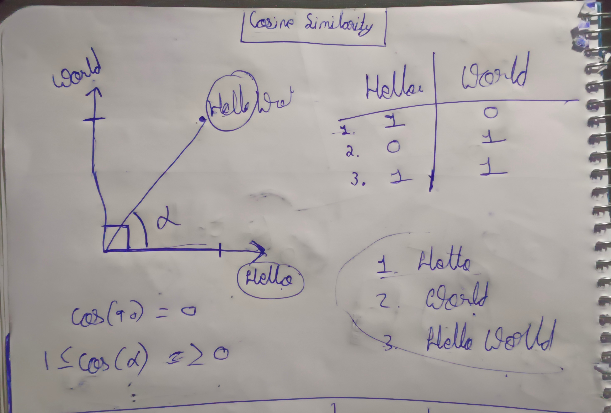

# Kubrick: Movie Recommender System

Kubrick is a thing I made that uses cosine similarity on the overviews of several movies to make recommendations based on their similarity scores. The output includes the titles, posters, and overviews of five recommendations.

The web app is built with Gradio and deployed using Hugging Face Spaces. [Check it out here!](https://huggingface.co/spaces/sahilgarje/Kubrick)

---

## Steps to Run:

1. **Install dependencies:**
    ```bash
    pip install -r requirements.txt
    ```

2. **Unzip the model file:**
   Unzip the `model.zip` file into the project directory:
    ```bash
    unzip model.zip
    ```
   *Note: The model was zipped because it exceeds 100 MB. This keeps things simpler than setting up Git LFS.*

3. **Set up environment variables:**
   Create a `.env` file in the project root and add your OMDB API key:
    ```env
    OMDB_API_KEY=<your_omdb_api_key>
    ```

4. **Run the application:**
    ```bash
    python app.py
    ```

---

## Extra:

1. **Adjusting the Model Threshold:**
   The default threshold in `app.py` is set very high (500) to reduce the model size. Lowering it (e.g., to 200) can include more movies for recommendations, giving a broader range of results. Adjust the threshold to suit your needs. (the deployment has 200 as the threshold)

2. **Rebuilding the Model File:**
   If you want to generate a new model file with a higher or lower threshold:
   - Download the [movies dataset](https://www.kaggle.com/datasets/asaniczka/tmdb-movies-dataset-2023-930k-movies).
   - Move the dataset to this project directory.
   - Delete the `.pkl` and `.npz` files.
   - Run `app.py` to rebuild the model.

---

## Cosine Similarity: How It Works

Cosine similarity is a metric that tells us how similar or different things (e.g., movie overviews) are. It’s calculated by finding the cosine of the angle between two vectors representing the text.

Here’s a quick example:

| Sentence                        | Positive/Negative |
|---------------------------------|-------------------|
| I love *2001: A Space Odyssey*! | Positive          |
| *2001* is great!                | Positive          |
| *2001* is a masterpiece!        | Positive          |
| *2001* is slow yet beautiful!   | Positive          |
| *2001* = boring                 | Negative          |

Sentences 1 to 4 are similar (positive reviews), while Sentence 5 is quite different (negative). Cosine similarity scores range from **-1** (completely opposite) to **1** (completely similar).

### Steps in Cosine Similarity:
1. Make a table of word counts.
2. Plot the points in a high-dimensional space.
3. Figure out the angle between the vectors.
4. Use the formula to calculate the cosine of the angle.
5. Compare the results!

Here’s a visual representation (it's terrible ik but this is all my 3 brain cells can do):


